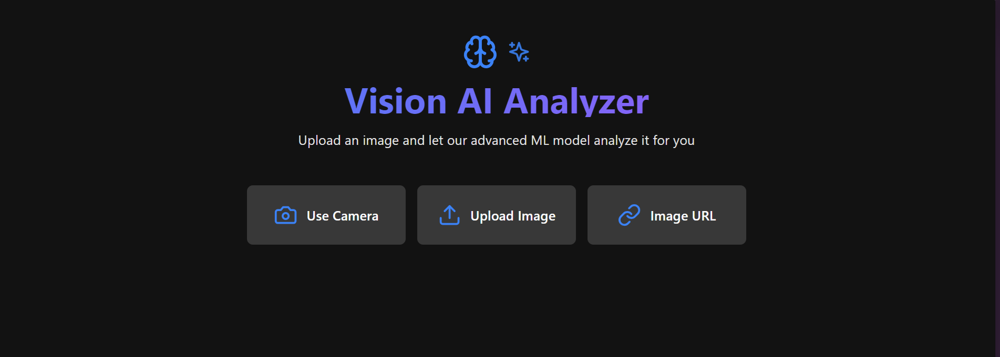

# Detectique


## Introduction 

****

This project demonstrates an end-to-end deep learning application using Google's image detection model. It includes a web application built with Flask for the backend and React for the frontend. Users can upload an image, which is then processed by the model, and the predictions are displayed on the website.

## Hugging Face Model Used

****

This project utilizes the google/vit-base-patch16-224 model from Hugging Face. The Vision Transformer (ViT) model is designed for image classification tasks and leverages a transformer architecture typically used in natural language processing. This model breaks images into patches, processes them as sequences, and provides powerful image recognition capabilities.

Key features of google/vit-base-patch16-224:

- Architecture: Transformer-based, using patches of size 16x16.
- Input Resolution: 224x224 pixels.
- Pre-trained Weights: The model is pre-trained on extensive image datasets, ensuring robust performance.
- Usage: Ideal for tasks requiring high accuracy in image classification and detection.

## Tech Used

****

learning application. The key technologies used include:

### Backend:

 * Flask: A lightweight WSGI web application framework in Python used for building the server-side logic.

### Frontend:

 * React: A JavaScript library for building user interfaces, used for creating the interactive front-end of the web application.

### Deep Learning Model:

 * Google's Image Detection Model: Utilized for image detection and classification tasks.
 * Hugging Face google/vit-base-patch16-224: A Vision Transformer model for image classification.

### Other Tools and Libraries:

 * TensorFlow/PyTorch: Deep learning frameworks used for training and running the image detection models.
 * Pillow: A computer vision library used for image processing tasks.
 * Axios: A promise-based HTTP client for making API requests from the frontend.
 * Redux: A state management library used in React applications to manage the application state.
 * Bootstrap/Material-UI: CSS frameworks used for designing responsive and modern user interfaces.

## Installation

****

1. Download the repo as a zip file or clone it using the following command
```
git clone https://github.com/AkshatVH/Image_processing.git
```
2. Make sure you have node.js installed in your system
3. Open your CLI,_ (I recommend using an seperate environment, if your planning it to use for development)_ and install the required libraries by the following command
```
    pip install -r requirements.txt
    npm install
```
4. Run the following commands in the command line to get your flask app started
```
    set FLASK_APP=main.py
    python main.py
```
5. Open another terminal in the project directory
```
    npm run dev
```
## Contents

****

p-5
